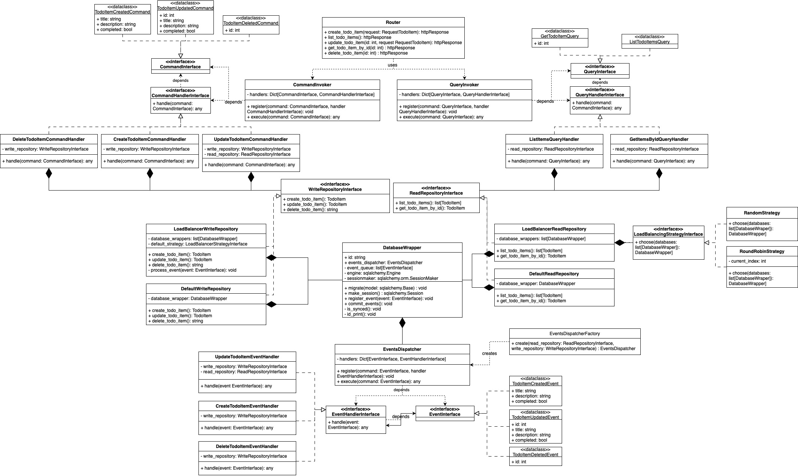

# Load balancer for databases 

Implemented with Python with FastAPI and SQLAlchemy

## Preconditions
- Docker
- Some Http client (e.g. Postman)

## How to run
1. Clone the repository
2. (optional) Change the database configuration  
    - Open `docker-compose.yml`
    - Add/Remove databases in the `services` section
    - Add/Remove database url in the `src/data/config.py` file
3. Run the system
   - If you have `make` installed, run 
    ```bash
    make ubuild
    ```
    - Otherwise, run
     ```bash
    docker-compose up --build
    ```
4. Open `http://localhost:8000/docs` in your browser to see the API documentation.
5. Use the API to interact with the database.    
 
   For example, to create a new todo item send a POST request to `http://localhost:8000/todo` with the following body:
    ```json
    {
        "parameter": {
            "completed": true,
            "description": "string",
            "title": "string"
        }
    }
    ```
    To get all todo items send a GET request to `http://localhost:8000/todo`.

## Basic Documentation
### Class relations diagram:

   
### Example Design Patterns:
#### Command

#### Repository

#### Strategy


